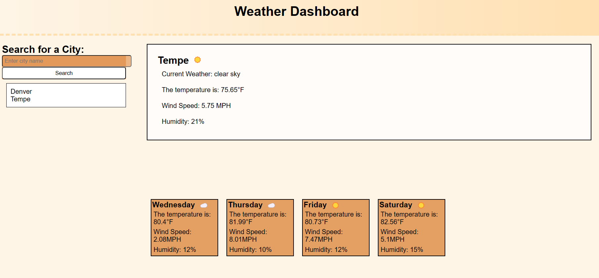

# Server-side-APIs

 

## Description

This application provides real time weather data in an easy to consume format. There is a large section for the present day weather with the temperature, humidity, and wind speed. There is also a search bar that holds your previous searches in a section beneath the button. Those previos searches are clickable if you want to loo at those locations again. The forecasts for the next few days are in cards beneath the main box. These update with each search and have a picture icon that corresonds with the weather.

## Table of Contents

- [Description](#description)
- [Usage](#usage)
- [Finished Application](#finishedApplication)
- [Questions](#questions)

## Use

This application can be used to view the weather in any city you wish to view. It would be useful for trip planning or daily use.

## Finished Application

## Questions

For questions or feedback regarding this project, please contact me at JoAplon, through my [github](https://github.com/undefined), or my email, jordan0aplon@gmail.com.
